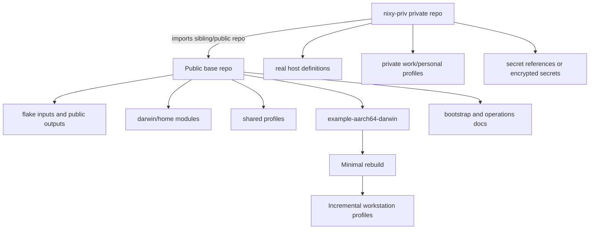

# feat: Create Determinate Nix macOS host foundation

## Overview

Create the first reusable macOS workstation configuration foundation for this repo. The plan starts with a public-safe base flake that can build one Apple Silicon example host, then layers Home Manager, nix-homebrew/Homebrew, conservative workstation profiles, docs, validation, and a private-overlay contract for the sibling private repo `nixy-priv` (`https://github.com/robsdudeson/nixy-priv`).

The critical sequencing decision is to prove a minimal `darwin-rebuild` first. Full workstation bootstrap is the destination, but Homebrew casks, MAS apps, secrets, and broad macOS defaults land only after the Determinate Nix / nix-darwin ownership boundary is verified.

---

## Problem Frame

The origin brainstorm defines a reusable macOS host-configuration repo that can bootstrap and maintain multiple Macs with Determinate Nix, nix-darwin, Home Manager, and a private overlay (see origin: `docs/brainstorms/determinate-nix-macos-host-requirements.md`). The repo must be safe to publish while still supporting a full workstation for real machines through private configuration.

The repo is currently almost empty. That makes this a greenfield foundation plan: the implementation must establish structure, safety boundaries, and operating conventions without turning the repo into a premature framework.

---

## Requirements Trace

- R1. Public base contains no secrets, tokens, unencrypted identity material, or sensitive hostnames.
- R2. Multiple hosts are supported through shared profiles plus host-specific composition.
- R3. Public-safe base and private overlay responsibilities are explicit and cannot accidentally leak private inputs into committed files.
- R4. Initial structure stays small and readable.
- R5. Determinate Nix owns the Nix installation and daemon.
- R6. nix-darwin manages macOS/system configuration while not managing Nix itself.
- R7. Home Manager manages user-level shell, Git, CLI, and dotfile-shaped config.
- R8. v1 supports Apple Silicon only; Intel support is explicitly unverified/out of scope unless researched later.
- R9. Full workstation scope eventually includes CLI tools, shells, Git, dev tooling, fonts, macOS defaults, Homebrew brews/casks, and optional MAS apps.
- R10. GUI apps use declarative management where stable, with documented manual escape hatches.
- R11. Secrets are external or encrypted; plaintext secrets must not enter flakes or generated store paths.
- R12. Bootstrap, rebuild, update, rollback, and host-addition flows are documented.
- R13. The first milestone proves a minimal host rebuild before the full workstation catalog.
- R14. Validation commands exist before risky system changes.

**Origin actors:** A1 Host owner, A2 Future maintainer/agent, A3 Private overlay
**Origin flows:** F1 Bootstrap a new Mac, F2 Add a second host

---

## Scope Boundaries

- Do not manage plaintext secrets in Nix files, Home Manager file contents, flakes, or generated dotfiles.
- Do not support Intel macOS in v1; Determinate Nix currently targets Apple Silicon macOS, so `x86_64-darwin` needs separate research before support.
- Do not require all GUI app state to be declarative on day one.
- Do not use destructive Homebrew cleanup during initial adoption.
- Do not have nix-darwin manage the Nix daemon, channels, or `/etc/nix/nix.conf` while Determinate owns Nix.
- Do not create or manage macOS user accounts in milestone 1; assume the primary user already exists.
- Do not build a general host framework before one minimal host rebuild works.

### Deferred to Follow-Up Work

- Secret manager integration: choose and add `sops-nix`, `agenix`, or 1Password CLI conventions after the no-secrets boundary is documented.
- Full private repo implementation: document the contract in this repo first; populate the existing sibling private repo `nixy-priv` in a separate implementation pass.
- MAS app management: add only after specific app IDs and App Store login assumptions are known.
- Existing-Mac migration hardening: add backup/inventory guidance after the fresh/low-risk bootstrap path works.

---

## Context & Research

### Relevant Code and Patterns

- The repo has no existing Nix implementation files, module patterns, tests, or validation scripts.
- Existing origin docs:
  - `docs/brainstorms/determinate-nix-macos-host-requirements.md`
  - `.agents/plans/2026-09-18-001-determinate-nix-macos-setup.md`
- This plan creates the first repo conventions for flake structure, host composition, profile boundaries, documentation, and validation.

### Institutional Learnings

- No `docs/solutions/` learnings exist for this repo.
- This implementation should become the first captured pattern after it succeeds, especially around Determinate Nix ownership, public/private separation, and minimal-first macOS bootstrap.

### External References

- Determinate nix-darwin guide: `https://docs.determinate.systems/guides/nix-darwin/`
- Determinate install docs: `https://manual.determinate.systems/installation/index.html`
- nix-darwin manual/options: `https://nix-darwin.github.io/nix-darwin/manual/`
- Home Manager nix-darwin module docs: `https://nix-community.github.io/home-manager/`
- nix-homebrew README: `https://github.com/zhaofengli/nix-homebrew`
- mac-app-util README: `https://github.com/hraban/mac-app-util`
- Nix flake manual and `--override-input` docs: `https://nix.dev/manual/nix/latest/command-ref/new-cli/nix3-flake`

---

## Key Technical Decisions

- Public/private direction: the public repo should be standalone and reusable; the existing sibling private repo `nixy-priv` should import the public repo for real host definitions. This avoids committed private inputs, private lock entries, and public repo evaluation failures.
- Host identity: public host outputs use sanitized aliases such as `example-aarch64-darwin`; real hostnames and usernames belong in `nixy-priv` unless intentionally non-sensitive.
- Nix ownership: milestone 1 uses explicit `nix.enable = false` in a Determinate boundary module. The Determinate nix-darwin module can be considered later if custom Determinate settings are needed.
- Platform: v1 is Apple Silicon only (`aarch64-darwin`). Intel is an unsupported follow-up because current Determinate Nix support has dropped `x86_64-darwin` in recent releases.
- Homebrew: use `nix-homebrew` for Homebrew/tap installation and nix-darwin `homebrew.*` for brews/casks. Start with non-destructive activation behavior.
- MAS: pick one MAS mechanism when needed. Prefer keeping MAS optional until app IDs and Apple ID state are known.
- Secrets: milestone 1 has no secret manager. Documentation must state that plaintext secrets and secret file contents must not enter Nix expressions or the Nix store.
- User management: assume the macOS user already exists for v1. Configure references and Home Manager only.

---

## Open Questions

### Resolved During Planning

- Private overlay mechanism: use the existing private repo `nixy-priv` (`https://github.com/robsdudeson/nixy-priv`), checked out as a sibling to this repo. It should import the public repo as the safest v1 pattern; document optional local override patterns only as future/advanced usage.
- First architecture: support `aarch64-darwin` only in v1.
- User creation: do not create/manage macOS users in milestone 1; require an existing primary user.
- First switch path: public `example-aarch64-darwin` is build/evaluation-safe; a real `switch` must use an existing macOS username supplied by `nixy-priv` or a local ignored override.
- Homebrew cleanup: no destructive cleanup in early profiles.
- Secrets: no secret wiring in milestone 1; document boundaries and defer tool selection.

### Deferred to Implementation

- Exact example username and host alias: use clearly fake defaults for public evaluation; a real first switch must use `nixy-priv` or a local ignored override with the actual existing macOS username.
- Exact package/app inventory: start with a tiny public baseline, then classify inventory items as base/developer/gui/private/manual.
- Formatter choice: pick one Nix formatter during implementation, but do not block minimal rebuild on advanced linting.
- Whether to adopt Determinate's nix-darwin module: defer until the base `nix.enable = false` path is working or custom Determinate settings are needed.

---

## Target End-State Structure

```text
.
├── flake.nix
├── flake.lock
├── README.md
├── justfile
├── docs/
│   ├── brainstorms/
│   │   └── determinate-nix-macos-host-requirements.md
│   ├── operations.md
│   ├── private-overlay.md
│   └── inventory.md
├── hosts/
│   └── example-aarch64-darwin/
│       └── default.nix
├── modules/
│   ├── darwin/
│   │   ├── determinate.nix
│   │   ├── home-manager.nix
│   │   ├── homebrew.nix
│   │   ├── macos-defaults.nix
│   │   └── fonts.nix
│   └── home/
│       ├── direnv.nix
│       ├── git.nix
│       └── shell.nix
├── profiles/
│   ├── minimal.nix
│   ├── developer.nix
│   ├── gui.nix
│   └── workstation.nix
└── users/
    └── example.nix
```

This tree is the target shape after all implementation units. The initial U1-U2 proof should stay much smaller: `flake.nix`, `flake.lock`, `hosts/example-aarch64-darwin/default.nix`, `profiles/minimal.nix`, `modules/darwin/determinate.nix`, and minimal docs. The implementer may consolidate files if implementation shows a simpler structure is clearer, but should preserve the public/private, host/profile/module, and docs boundaries.

---

## High-Level Technical Design

> *This illustrates the intended approach and is directional guidance for review, not implementation specification. The implementing agent should treat it as context, not code to reproduce.*



The public repo should not need the private repo to evaluate. Real private host configs can import public modules/profiles from the private repo once the public base is stable.

---

## Implementation Units

- [x] U1. **Create the public flake foundation**

**Goal:** Add a flake that pins compatible inputs and exposes one Apple Silicon example host without private dependencies.

**Requirements:** R1, R2, R4, R8, R13

**Dependencies:** None

**Files:**
- Create: `flake.nix`
- Create: `flake.lock`
- Create: `hosts/example-aarch64-darwin/default.nix`
- Create: `profiles/minimal.nix`

**Approach:**
- Pin `nixpkgs`, `nix-darwin`, and `home-manager`, with nix-darwin and Home Manager following the same `nixpkgs` input.
- Define only `darwinConfigurations.example-aarch64-darwin` in the public repo.
- Set the platform to `aarch64-darwin` and avoid any Intel host output.
- Keep the host file as a composition point that imports a minimal profile and core modules rather than carrying large package catalogs.
- Avoid any private flake input or private path in milestone 1.

**Patterns to follow:**
- nix-darwin flake pattern using `nix-darwin.lib.darwinSystem` and `specialArgs`.
- Home Manager's documented nix-darwin module integration pattern.

**Test scenarios:**
- Happy path: evaluating the flake shows an `example-aarch64-darwin` darwin configuration without requiring any private repo.
- Edge case: running flake evaluation on a machine without a private overlay still succeeds for the example host.
- Error path: attempting to use an unsupported or undefined host target fails with a normal missing-output error, not a private-file leak.

**Verification:**
- The public flake evaluates with only public files.
- The host output is Apple Silicon only.
- No committed file references private hostnames, private flake inputs, private lock entries, secret paths, tokens, real emails, or private repo contents. Public docs may name `nixy-priv` because the user explicitly identified that repo as the intended private overlay.

---

- [x] U2. **Define the Determinate Nix ownership boundary**

**Goal:** Make the Nix ownership model explicit so Determinate owns Nix while nix-darwin owns macOS/system state.

**Requirements:** R5, R6, R12, R14, F1

**Dependencies:** U1

**Files:**
- Create: `modules/darwin/determinate.nix`
- Modify: `hosts/example-aarch64-darwin/default.nix`
- Modify: `docs/operations.md`

**Approach:**
- Add a small module whose purpose is the Determinate boundary.
- Set `nix.enable = false` for the initial path.
- Document what this means: nix-darwin must not manage the installed Nix version, daemon launchd service, or `/etc/nix/nix.conf`.
- Do not add normal nix-darwin `nix.*` settings in v1.
- Mention the Determinate nix-darwin module as a later option for `determinateNix.customSettings`, not as the first implementation path.

**Patterns to follow:**
- Determinate docs for using nix-darwin with Determinate Nix.
- nix-darwin option semantics for `nix.enable = false`.

**Test scenarios:**
- Happy path: the host configuration includes the Determinate boundary module and does not attempt to manage Nix through nix-darwin.
- Error path: docs explain that Nix daemon settings belong to Determinate, not ordinary nix-darwin `nix.*` options.
- Integration: minimal host build still includes nix-darwin-managed macOS/user packages while leaving Nix ownership disabled in nix-darwin.

**Verification:**
- A reviewer can point to one module/doc section that defines the ownership boundary.
- No module contradicts the boundary by adding nix-darwin Nix daemon settings.

---

### Milestone M1: Minimal Darwin proof gate

Stop after U1-U2 until the public example host can run flake evaluation and host build validation with `nix.enable = false`. A real switch may happen only through `nixy-priv` or a local ignored override that supplies an existing macOS username. Do not add Home Manager, Homebrew, workstation profiles, or macOS defaults until this gate passes.

- [x] U3. **Wire Home Manager with an explicit primary-user contract**

**Goal:** Manage user-level config through Home Manager as part of nix-darwin activation while making the primary-user contract explicit.

**Requirements:** R7, R12, R13, F1

**Dependencies:** U1, U2

**Files:**
- Create: `modules/darwin/home-manager.nix`
- Create: `users/example.nix`
- Create: `modules/home/git.nix`
- Create: `modules/home/shell.nix`
- Create: `modules/home/direnv.nix`
- Modify: `hosts/example-aarch64-darwin/default.nix`

**Approach:**
- Import `home-manager.darwinModules.home-manager` through a dedicated module or host composition.
- Use `home-manager.useGlobalPkgs = true` and `home-manager.useUserPackages = true`.
- Add a generic public `example` user config with fake-safe identity placeholders for evaluation/build.
- State clearly that `example-aarch64-darwin` is not a real switch target unless the machine actually has an `example` user.
- Require a real existing username from `nixy-priv` or a local ignored override before a real switch.
- Include basic shell, Git, and direnv-shaped modules without private keys, signing secrets, or real identity data.
- Configure direnv conservatively: do not auto-allow `.envrc` files, and document that users should review `.envrc` before running `direnv allow`.

**Patterns to follow:**
- Home Manager nix-darwin module docs.
- Existing-user assumption from this plan's Key Technical Decisions.

**Test scenarios:**
- Happy path: the public `example` user config can be evaluated and built as part of the example host.
- Edge case: no SSH private keys, GPG keys, tokens, or real email addresses are embedded in Home Manager file declarations.
- Error path: docs state that a real machine must supply an existing macOS username through `nixy-priv` or a local ignored override before switching a real host.
- Integration: Home Manager config builds with the same `pkgs` as nix-darwin via `useGlobalPkgs`.

**Verification:**
- User-level modules are reusable and do not contain secret material.
- The example host wires Home Manager once, not separately per profile.

---

- [x] U4. **Document bootstrap, rebuild, validation, and rollback flows**

**Goal:** Give future users/agents one safe entry point before any risky `switch` operation.

**Requirements:** R12, R13, R14, F1, F2

**Dependencies:** U1, U2, U3

**Files:**
- Create: `README.md`
- Create: `docs/operations.md`
- Create: `justfile`

**Approach:**
- Put quickstart/fresh bootstrap in `README.md`.
- Put detailed maintenance, update, rollback, existing-Mac adoption notes, and host-addition flows in `docs/operations.md`.
- Add a small `justfile` for discoverable validation aliases after the underlying commands are known.
- Sequence validation as: evaluate/check flake, build host config, then switch.
- Define rollback honestly: Nix/nix-darwin generations are rollbackable; Homebrew, MAS, and macOS defaults are best-effort and may need manual remediation.

**Patterns to follow:**
- nix-darwin bootstrap docs for first `nix run nix-darwin#darwin-rebuild -- switch --flake ...`.
- Determinate installer docs for installing Determinate Nix before nix-darwin.

**Test scenarios:**
- Happy path: a reader can follow README from Determinate Nix install to public build validation, then to a real first switch through `nixy-priv` or a local ignored override with an existing macOS username.
- Edge case: existing Mac adoption tells users to inventory/backup and build before switching.
- Error path: docs describe what to do when `darwin-rebuild` is not yet installed.
- Integration: host-addition docs reference the same profile/module structure created by earlier units.

**Verification:**
- A future agent can determine the correct pre-switch validation sequence without inventing it.
- README and operations docs do not include secrets, private hostnames, private flake inputs, or private lock entries. They may name `nixy-priv` as the intended sibling private repo convention.

---

- [x] U8. **Define the private-overlay contract**

**Goal:** Make the public/private boundary concrete enough that the existing sibling private repo `nixy-priv` can safely import this base.

**Requirements:** R1, R2, R3, R11, R12, F1, F2

**Dependencies:** U1, U2

**Files:**
- Create: `docs/private-overlay.md`
- Modify: `README.md`
- Modify: `docs/operations.md`
- Optionally modify: `flake.nix`

**Follow-up target repo:** `nixy-priv` may later add `flake.nix`, `README.md`, `hosts/<private-host>/default.nix`, and `users/<private-user>.nix`; those files are not part of this public-repo implementation unit.

**Approach:**
- Document the recommended v1 pattern: `nixy-priv` imports this public repo and defines real `darwinConfigurations`.
- Document the local checkout convention: this repo and `nixy-priv` live as sibling directories.
- List what belongs in private config: real usernames, sensitive hostnames, work apps, private taps, identity config, secrets references, encrypted secret files.
- List what must never be plaintext in public or private Nix expressions if it can enter the store: tokens, keys, passwords, secret file contents.
- If exposing public modules/profiles as flake outputs materially helps the private repo, add only small stable exports; avoid a broad custom framework.
- Include notes on `--override-input` or local path overrides as advanced patterns, with warnings about lock-file leakage.
- Add or document a `check-public-safety` validation that scans public config for denied private inputs, lock entries, real emails/usernames, `/Users/<real-user>` paths, token/key material, and private hostnames while allowing intentional docs references to `nixy-priv`.

**Patterns to follow:**
- Research recommendation that private repo imports public repo for strongest public-safety.
- Nix store secrecy warning: store paths are readable to all users.

**Test scenarios:**
- Happy path: `nixy-priv` can identify which public modules/profiles to import.
- Edge case: public repo still evaluates with no private repo present.
- Error path: docs warn against committing private flake URLs, private lock entries, or plaintext secrets.
- Integration: host-addition docs distinguish public example hosts from real private hosts.

**Verification:**
- A reviewer can tell exactly where private data should live.
- Public flake does not require or lock a private input unless deliberately added later with safeguards.

---

### Milestone M2: First real switch gate

Before U5-U7, prove one real minimal host switch through `nixy-priv` or a local ignored override using an existing macOS username. If no real switch target is available, stop after public build validation and keep U5-U7 deferred.

**Execution status:** Deferred. `nixy-priv` currently has no real host flake, so this pass stops after public build validation and the private-overlay contract.

- [ ] U5. **Add conservative workstation profiles**

**Goal:** Create composable public profiles for minimal, developer, GUI, and workstation use without adding a giant host file.

**Requirements:** R2, R4, R9, R10, R13, F2

**Dependencies:** U1, U3, U4, U8, successful minimal host build/switch gate

**Files:**
- Modify: `profiles/minimal.nix`
- Create: `profiles/developer.nix`
- Create: `profiles/gui.nix`
- Create: `profiles/workstation.nix`
- Create: `docs/inventory.md`
- Modify: `hosts/example-aarch64-darwin/default.nix`

**Approach:**
- Keep `minimal` as the first-rebuild profile with only safe CLI basics.
- Add `developer`, `gui`, or `workstation` only when each has at least two concrete public-safe declarations or a documented `nixy-priv` consumer; otherwise defer the file and record the intended classification in `docs/inventory.md`.
- Add `developer` for public-safe dev tooling after minimal rebuild works.
- Add `gui` as the home for fonts/Homebrew GUI support, but keep casks/MAS sparse until inventory is known.
- Add `workstation` as an importer/composer rather than a package dump once there is enough real inventory to justify it.
- Add `docs/inventory.md` with classification rules: package/app name, install method, profile, public/private status, and manual notes.

**Patterns to follow:**
- Research package placement rules: system packages for host-wide core tools, Home Manager for user CLI/dotfiles, Homebrew for casks/MAS gaps, private repo for sensitive work apps.

**Test scenarios:**
- Happy path: importing `workstation` composes profiles instead of duplicating package lists.
- Edge case: a package with sensitive/work-specific meaning is classified as private or manual, not added to the public profile.
- Error path: GUI apps that require manual login/permissions are documented as manual escape hatches.
- Integration: second-host docs can reuse profiles without copying the first host's full config.

**Verification:**
- Profiles are small and named by responsibility.
- The public package inventory remains safe to publish.

---

- [ ] U6. **Add Homebrew and GUI management safely**

**Goal:** Support brews, casks, fonts, and optional MAS apps while avoiding destructive adoption behavior.

**Requirements:** R9, R10, R12, R14, F1

**Dependencies:** U4, U5, successful minimal host build/switch gate

**Files:**
- Create: `modules/darwin/homebrew.nix`
- Create: `modules/darwin/fonts.nix`
- Modify: `profiles/gui.nix`
- Modify: `docs/operations.md`
- Modify: `docs/inventory.md`
- Modify: `flake.nix`

**Approach:**
- Add `nix-homebrew` input and module when Homebrew itself should be managed.
- Source `nix-homebrew.user` from the same primary-user contract used by Home Manager.
- Keep existing Homebrew migration opt-in: fresh installs should not silently adopt/migrate an unmanaged prefix; existing installations require explicit docs before enabling migration.
- Use nix-darwin `homebrew.*` for package declarations.
- Start with `cleanup = "none"` or equivalent non-destructive behavior.
- Document that `homebrew.enable` alone does not install Homebrew; `nix-homebrew` or manual Homebrew install is required.
- Treat MAS as optional and choose one mechanism before adding real MAS apps.
- Add fonts through nix-darwin where stable.
- Add supply-chain review rules to `docs/inventory.md`: approved taps only, no private/unknown taps in the public repo, review cask installer source and permissions before adding, prefer Nix packages over casks when trust is unclear, and document update hygiene for flake inputs and Homebrew inventory.

**Patterns to follow:**
- nix-homebrew for Homebrew/taps installation.
- nix-darwin Homebrew module for brews/casks/MAS declarations.
- Research warning that MAS requires App Store sign-in and removed `homebrew.masApps` are not automatically uninstalled.

**Test scenarios:**
- Happy path: Homebrew module can declare a small non-sensitive brew/cask set without cleanup removing existing user apps.
- Edge case: a manually installed app can remain manual because cleanup is non-destructive.
- Error path: docs explain MAS failure when the user is not signed into the App Store or does not own the app.
- Error path: missing primary user or unmanaged Homebrew prefix produces a clear documented stop rather than silent migration.
- Integration: GUI profile imports Homebrew/fonts without breaking minimal profile users.

**Verification:**
- Homebrew adoption is opt-in by profile and non-destructive initially.
- MAS and cask limitations are documented before any broad app catalog is added.

---

- [ ] U7. **Add low-risk macOS defaults**

**Goal:** Introduce macOS defaults carefully, with clear reversibility limits and host/profile scope.

**Requirements:** R9, R10, R12, R14

**Dependencies:** U4, U5, successful minimal host build/switch gate

**Files:**
- Create: `modules/darwin/macos-defaults.nix`
- Modify: `profiles/workstation.nix`
- Modify: `docs/operations.md`

**Approach:**
- Start with low-risk, broadly acceptable settings only.
- Group defaults by area: Finder, Dock, keyboard/trackpad, screenshots, security/privacy.
- Comment or document settings that require logout, restart, app relaunch, or manual privacy approval.
- Avoid aggressive settings that surprise users or vary by host until private profiles exist.

**Patterns to follow:**
- nix-darwin `system.defaults.*` option docs.
- Scope boundary that full GUI app state need not be declarative on day one.

**Test scenarios:**
- Happy path: workstation profile can include low-risk defaults without affecting minimal profile users.
- Edge case: host-specific or taste-specific defaults are deferred to private profiles.
- Error path: docs warn that some defaults are not reliably reversed by Nix generation rollback.

**Verification:**
- Defaults are minimal, grouped, and documented for reversibility.
- No setting changes security/privacy behavior without an explicit note.

---

## System-Wide Impact

- **Interaction graph:** Determinate Nix owns Nix daemon/config; nix-darwin owns macOS/system/profile activation; Home Manager runs under nix-darwin; nix-homebrew/Homebrew manage GUI/brew gaps; `nixy-priv` composes public modules for real hosts.
- **Error propagation:** Flake evaluation/build failures should happen before switch; activation failures must be documented as switch-time risks; MAS/Homebrew failures may be external-auth or app-state issues rather than Nix expression bugs.
- **State lifecycle risks:** Nix generations are rollbackable; Homebrew casks, MAS apps, and macOS defaults are not fully rollback-equivalent and need manual remediation notes.
- **API surface parity:** Public flake outputs, module paths, profile names, and docs form the repo's API for future private hosts.
- **Integration coverage:** A successful minimal `darwin-rebuild build/switch` is the key integration proof; flake evaluation alone is not enough.
- **Unchanged invariants:** The repo must remain public-safe and must not introduce a private dependency for the example host.

---

## Risks & Dependencies

| Risk | Mitigation |
|------|------------|
| nix-darwin accidentally manages Nix while Determinate owns it | Centralize boundary in `modules/darwin/determinate.nix`; use `nix.enable = false`; avoid ordinary nix-darwin `nix.*` settings in v1 |
| Private material leaks into public repo or lock file | Make public repo standalone; `nixy-priv` imports public; document lock/override hazards |
| First switch damages an existing workstation state | Require build/check before switch; separate fresh/low-risk bootstrap from existing-Mac adoption notes |
| Homebrew cleanup removes manually installed apps | Start with non-destructive cleanup; add casks incrementally |
| MAS installs fail due to Apple ID state | Keep MAS optional and document login/ownership prerequisites |
| Secrets enter the Nix store | No secret manager in milestone 1; document forbidden patterns before adding secret-dependent modules |
| Plan over-abstracts into a framework | Keep host/profile/module structure simple; expose only small public outputs if needed |
| Intel Mac assumptions break | v1 supports only Apple Silicon; require separate research for Intel |

---

## Documentation / Operational Notes

- `README.md` should be the single quickstart entry point.
- `docs/operations.md` should cover first switch, normal rebuild, updates, rollback, existing-Mac adoption caveats, and adding hosts.
- `docs/private-overlay.md` should cover public/private boundaries, sibling checkout conventions for `nixy-priv`, and secret rules.
- `docs/inventory.md` should guide how packages/apps are classified before adding a large catalog.
- After the first successful host rebuild, capture a durable learning under `docs/solutions/` with `/ce-compound` or equivalent.

---

## Sources & References

- **Origin document:** [docs/brainstorms/determinate-nix-macos-host-requirements.md](docs/brainstorms/determinate-nix-macos-host-requirements.md)
- Existing draft: [.agents/plans/2026-09-18-001-determinate-nix-macos-setup.md](.agents/plans/2026-09-18-001-determinate-nix-macos-setup.md)
- Determinate with nix-darwin: `https://docs.determinate.systems/guides/nix-darwin/`
- Determinate installation: `https://manual.determinate.systems/installation/index.html`
- nix-darwin manual/options: `https://nix-darwin.github.io/nix-darwin/manual/`
- Home Manager docs: `https://nix-community.github.io/home-manager/`
- nix-homebrew: `https://github.com/zhaofengli/nix-homebrew`
- mac-app-util: `https://github.com/hraban/mac-app-util`
- Nix flakes manual: `https://nix.dev/manual/nix/latest/command-ref/new-cli/nix3-flake`
