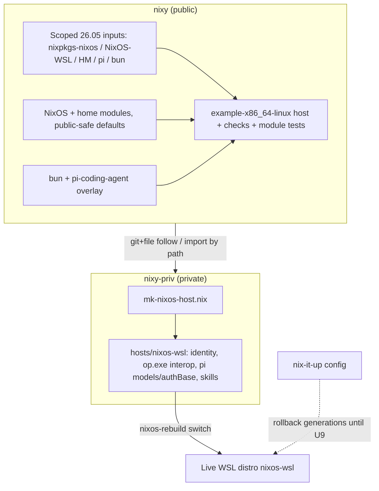

# feat: Migrate nixos-wsl host into nixy + nixy-priv

## Overview

Migrate the live NixOS WSL2 host `nixos-wsl` (currently configured by the flake in `/home/rd/code/nix-it-up`, pinned to the 26.05 release line) into this repo's two-repo setup: public framework `nixy` + private sibling `nixy-priv`.

The migration is **additive NixOS support** for a Darwin-only repo. Public `nixy` gains a scoped 26.05 input set, a fake-safe example NixOS WSL host as the public validation target, ported public-safe modules (fish, gh, vscode, git extensions, declarative pi, NixOS common/WSL machine modules), and ported module unit tests. Private `nixy-priv` gains `lib/mk-nixos-host.nix` mirroring the existing darwin helper, plus the real `hosts/nixos-wsl` with all private values (git identity, 1Password/op.exe interop, LAN endpoints, curated pi packages/settings).

Sequencing: prove the public NixOS path builds cleanly without any private data (M1), then compose the real host and dry-build it on the live machine (M2), then switch the live WSL distro with a verification checklist (M3), and only after a verified switch decommission `nixos-wsl` from nix-it-up while leaving `nixos-wsl2` untouched.

This is a **migration, not an upgrade**: the host stays on its exact current 26.05 channel set, state anchors are preserved, and Windows-side 1Password trust boundaries are unchanged.

---

## Problem Frame

`nixos-wsl` is the user's primary NixOS workstation (WSL2 distro, 26.05 line) running pi-coding-agent with a local Unsloth/llama stack, 1Password-backed git signing and credentials via Windows `op.exe` interop, and skill-manager-managed agent skills. It currently lives in `nix-it-up`, a mixed multi-host repo that also carries `nixos-wsl2` (25.05), `nixos-utm-vm`, `home-nas`, and a Darwin host.

The two-repo setup (`nixy` public + `nixy-priv` private) was built for the user's Macs only: nixy has no NixOS outputs, no Linux home modules beyond zsh/git/direnv, no NixOS example host, and its tooling (bootstrap.sh, justfile, docs) is Darwin-only. The WSL host cannot move until nixy can express a NixOS WSL system public-safely and nixy-priv can compose it with the same `mk-*-host` pattern used for darwin.

Constraints that shape the design (from institutional learnings in both repos):

- Preserve the scoped 26.05 line for this host; do not force it onto repo-wide channel defaults or change state anchors (`system.stateVersion = "26.05"`, `home.stateVersion = "26.05"`).
- WSL compatibility belongs in a narrow explicit module; host identity, users, `wsl.defaultUser`, ssh-agent, Windows paths, and signing helpers stay host-local (private).
- Release-pinned NixOS-WSL matching the system line (`release-26.05`).
- Windows-side `op.exe`, SSH agent, and `op-ssh-sign-wsl.exe` are part of the host trust boundary — keep them host-local; never log agent/op/secret-bearing output during validation.
- `programs.nix-ld` is intentional for WSL binary compatibility (VS Code/Node) — do not drop it.
- Pi and skill-manager mutable directories must remain writable; no read-only store symlinks over `~/.pi/agent` or `~/.config/agents/skills`.
- Public repo must evaluate without the private repo and pass `scripts/check-public-safety.sh`.

---

## Requirements Trace

**Behavior preservation:**
- R1. Live host behavior is preserved: same 26.05 input set (same locked revisions, not just branch refs), state anchors, WSL default user, Windows-side 1Password trust boundary, nix-ld, skill-manager invariants.

**Repo boundaries & public safety:**
- R2. Public `nixy` stays standalone and public-safe (no real hostnames, emails, op:// refs, LAN IPs, personal package curation); `check-public-safety.sh` — extended to reject RFC1918 IP literals — passes.
- R3. Private values (git identity + signing key, op:// references, LAN endpoints, curated pi packages/settings/models/authBase) live only in `nixy-priv`, and the private repo's remote/visibility is verified before those values are committed.

**Additive scope & staged validation:**
- R4. Additive only: existing nixy Darwin contracts (modules, profiles, example host, bootstrap darwin path) are unchanged and keep passing.
- R5. `nixos-wsl2` (and all other nix-it-up hosts) continue to evaluate before and after every change, including the decommission unit.
- R6. Staged validation with gates: public checks → private dry-build on live host → live switch with verification checklist → decommission. No switch before M2 passes; no decommission before M3 passes.

**Tests, docs, operations:**
- R7. Module unit tests are ported for every ported module (user decision), runnable from the nixy flake.
- R8. Docs updated so a future agent can rebuild, update, and roll back the WSL host from the new repos: operations, pi strategy, README, private-overlay contract.
- R9. The `nix-switch` fish abbr on the live host points at the new flake (`/home/rd/code/rd/nixy-priv#nixos-wsl`) after migration.

**Rollback:**
- R10. Rollback is available at every stage: public units are git-revertible; the live host keeps prior Nix generations until decommission.

**Actors:** A1 Host owner (live WSL distro), A2 Future maintainer/agent, A3 `nixy-priv` as private overlay
**Flows:** F1 Rebuild/update the WSL host from nixy-priv, F2 Roll back a bad switch

---

## Scope Boundaries

- No channel upgrade: the host stays on `nixpkgs nixos-26.05` + `NixOS-WSL release-26.05` + `home-manager release-26.05`. Moving to unstable is a separate future decision.
- Do not touch `nixos-wsl2`, `nixos-utm-vm`, `home-nas`, or the Darwin host in nix-it-up; shared modules there stay in place until (and unless) their own migrations happen.
- No secret manager introduction: the existing mechanism (Windows `op.exe` interop, op:// references in private Nix files, command-backed pi auth keys resolved at login) is carried over unchanged.
- No skill-manager behavior changes: scripts, services, and the `~/.config/agents/skills` real-directory invariant move as-is into private config. The deferred XDG compat-symlink extraction from nix-it-up is **not** picked up here; the existing one-off activation logic moves verbatim.
- No CI setup (nix-it-up has none either); parity with existing validation tooling only.
- No changes to `modules/my/programs/ssh.nix` or its port: the WSL host does not enable it (it uses `wsl.ssh-agent` + git `sshSigningProgram` instead).
- macOS 1Password SSH socket module, llama-server launchd module, and other Darwin-specific nixy modules are out of scope.

### Deferred to Follow-Up Work

- Porting the XDG compat-symlink extraction (nix-it-up plan `2026-09-11-003`) into a reusable guarded module; the WSL host keeps its inline activation until then.
- Revisiting the `nixpkgs-bun` PR-branch input once the bun fix is merged/backported into 26.05 (existing TODO carried over).
- Migrating `nixos-wsl2` or any other nix-it-up host.
- Removing now-duplicated shared modules from nix-it-up after all its hosts have migrated.
- Re-evaluating whether the declarative pi module should replace the bun-based `modules/home/pi.nix` repo-wide (kept separate for this migration).

---

## Context & Research

### Source host shape (`/home/rd/code/nix-it-up`)

`nixos-wsl` in `flake.nix`:

```nix
nixosConfigurations.nixos-wsl = nixpkgs-26.lib.nixosSystem {
  system = "x86_64-linux";
  modules = [
    nixos-wsl-26.nixosModules.default
    { nixpkgs.overlays = [ (_final: _prev: {
        bun = nixpkgs-bun.legacyPackages.x86_64-linux.bun;
        pi-coding-agent = pi.packages.x86_64-linux.pi;
      }) ]; }
    ./modules/my/machine/hostname.nix
    ./modules/my/machine/common.nix
    ./modules/my/machine/wsl.nix
    home-manager-26.nixosModules.home-manager
    { home-manager.sharedModules = [ /* fish gh git pi ssh vscode */ ];
      home-manager.extraSpecialArgs = { inherit self; }; }
    ./hosts/nixos-wsl/configuration.nix
  ];
};
```

Inputs (all to be mirrored in nixy): `nixpkgs-26` = `NixOS/nixpkgs/nixos-26.05`; `home-manager-26` = `release-26.05` follows `nixpkgs-26`; `nixos-wsl-26` = `NixOS-WSL/release-26.05` follows `nixpkgs-26`; `pi` = `earendil-works/pi/stable`; `nixpkgs-bun` = `NixOS/nixpkgs/pull/556047/head` (TODO: switch back once merged).

`hosts/nixos-wsl/configuration.nix` (current HEAD, read in full): system-level `my.machine.{common,hostname,wsl}`, `wsl.defaultUser = "rd"`, systemPackages (bun, gcc, gnumake, nodejs, python3), `op = "op.exe"` alias, neovim, system fish, `users.users.rd` (wheel, fish), `system.stateVersion = "26.05"`, `wsl.ssh-agent.enable`. The inline `home-manager.users.rd` block (stateVersion 26.05) contains the **private** payload: `.config/op/.env` with an op:// GITHUB_TOKEN ref, skill-manager bootstrap/sync scripts + user and system services, git identity (real name/email/signing key, `op-ssh-sign-wsl.exe` signing program), gh config, the full declarative pi block (curated ~20-package list, settings, models for google/ollama/ollama-remote/unsloth, `authBase` with a command-backed op:// unsloth key), `PI_JEV_BASE_URL` LAN endpoint, fish abbrs (`nix-switch`, `skills-link`, `skills-sync`), git credential helper `!op git-credential` + GitHub SSH URL rewrite.

### Ported module inventory (from source research)

| Source module | Options | Public-safe? | nixy destination |
|---|---|---|---|
| `programs/fish.nix` | `my.programs.fish.enable` (tide, abbrs g/l/ll/v/vi/vim/ops/opl/opg, fastfetch greeting) | Yes | new `modules/home/fish.nix` |
| `programs/gh.nix` | `my.programs.gh.enable` (aliases co/pv/pvw) | Yes | new `modules/home/gh.nix` |
| `programs/git.nix` | enable, userName, userEmail, signingKey, aliases, workstationDefaults, sshSigningProgram, sshCommand | Module yes; values private | extend existing `modules/home/git.nix` with optional signing options (fake defaults preserved) |
| `programs/pi.nix` | enable, package, settings, models, authBase, agentInstructionsFile, reconcilePackagesOnLogin; pi-auth-merge + pi-package-reconcile user services | Module yes; default package list/settings are personal curation → private | new `modules/home/pi-declarative.nix` with empty safe defaults |
| `programs/vscode.nix` | `my.programs.vscode.enable` (extensions + settings) | Yes | new `modules/home/vscode.nix` |
| `machine/common.nix` | enable, nh.enable, packages.enable, editor; nix experimental features, allowUnfree, systemPackages (1password-cli, git-crypt, nh, nixfmt) | Yes | new `modules/nixos/common.nix` |
| `machine/wsl.nix` | `my.machine.wsl.enable`; `wsl.enable` + `programs.nix-ld` | Yes | new `modules/nixos/wsl.nix` |
| `machine/hostname.nix` | `my.machine.hostname` → networking.hostName | Yes, but unnecessary | not ported — nixy-priv host sets `networking.hostName = hostName` directly (mirrors darwin pattern) |

Post-research deltas incorporated (commits after initial research read): `pi-auth-merge` now resolves command-backed api_keys at login and caches the resolved secret into `auth.json` (fixes subagent auth re-resolution); the WSL host's pi block was consolidated and `PI_JEV_BASE_URL` moved to the HM root. The ported module must carry the full current script.

### Target repo patterns (from nixy/nixy-priv research)

- `nixy-priv/lib/mk-darwin-host.nix`: `{inputs}` → function taking `{hostName, system?, primaryUser?, userModule?, modules?, specialArgs?}`, calls `nix-darwin.lib.darwinSystem` with `specialArgs = {inherit inputs hostName primaryUser} // specialArgs`, modules = host dir + HM user wiring. The NixOS helper mirrors this exactly.
- `nixy-priv/flake.nix`: follows `nixpkgs`/`nix-darwin`/`home-manager` from `nixy` via `git+file:../nixy`; exposes `darwinConfigurations.<host>` + `checks.<system>.<host>`. The NixOS additions follow the same shape.
- nixy home modules are mostly optionless (import = enable) with fake-safe `mkDefault` identity values; `llama-server.nix` proves optionful modules fit. Existing `modules/home/git.nix` sets fake identity via `mkDefault`.
- nixy's documented pi strategy (`docs/pi.md`, plan `2026-09-20-001`): "runtime declarative, pi imperative" — Nix installs Bun/Node, `pi` itself is manual `bun install -g`, `models.json`/`auth.json` are never Nix-managed on the Darwin path. That stance is preserved for Darwin; the new declarative module is the NixOS variant.
- `scripts/bootstrap.sh`: Darwin-only today (discovers `darwinConfigurations`, dry-builds `.system`, switches with `darwin-rebuild`). `justfile check` aggregates flake show, example dry-build, profile eval checks, bootstrap tests, public-safety scan.
- `scripts/check-public-safety.sh` blocks: private flake URLs, `/Users/<real-user>` paths, token/secret assignments, private key blocks, real emails (gmail.com/corp/company/work), op:// shaped values, 1Password sign-in URLs. It scans the public repo only — nixy-priv is exempt by design.
- Source tests are self-contained: each `*-test.nix` is `{pkgs ? import <nixpkgs> {}}:` → `lib.evalModules` with mocked HM options → assertion attrset; `tests/flake.nix` turns them into per-system checks. No full system eval required, so they port without a second lockfile.

### Institutional learnings

- nix-it-up: preserve scoped 26.05 line and state anchors (plan `2026-09-10-001`); narrow WSL module with host-local identity (plans `2026-09-10-001`, `2026-09-11-001`); release-pinned NixOS-WSL per system line (`2026-09-11-001`); `wsl.defaultUser` changes need the documented boot/terminate/root-start flow — do not change it here (`2026-09-11-001`, `docs/HOSTS.md`); Windows-side op/ssh/signing helpers are the trust boundary (`2026-09-11-001`); keep `nix-ld` (`2026-09-11-001`); pi/skill-manager dirs stay writable, no whole-dir store symlinks (plan `2026-09-11-002`, nixy plan `2026-09-20-001`); skill-manager invariant: `~/.config/agents/skills` real directory, `~/.agents` compat symlink (`2026-09-11-002`, `2026-09-11-003`); staged validation, full rebuild only in trusted WSL context (`docs/AGENT_TASKS.md`).
- nixy: public repo standalone; real hostnames/users in nixy-priv (plan `2026-09-18-001`); no private inputs/lock entries in public repo (same); declarative pi packaging was deferred for the Darwin path, "do not manage Linux/NixOS hosts here" was the v1 boundary this plan lifts additively (plan `2026-09-20-001`); avoid broad framework before real hosts prove the shape (plan `2026-09-18-001`).
- No `docs/solutions/` exists in either repo yet; capture a learning after M3 via `/ce-compound`.

---

## Key Technical Decisions

- **Channel strategy — scoped 26.05 input set in nixy, seeded from the live lock.** Add `nixpkgs-nixos` (`NixOS/nixpkgs/nixos-26.05`), `home-manager-nixos` (`release-26.05`, follows `nixpkgs-nixos`), `nixos-wsl` (`NixOS-WSL/release-26.05`, follows `nixpkgs-nixos`), `pi` (`earendil-works/pi/stable`), and `nixpkgs-bun` (PR 556047 head, TODO carried over). The existing Darwin input set (`nixpkgs-unstable` + master nix-darwin/home-manager) is untouched. Rationale: identical pinned inputs to the live host = zero behavior change; respects the prior "preserve scoped 26.05 line" decision; keeps repo-wide defaults honest per platform. **Same branch refs are not enough** — the new lock entries must be seeded from nix-it-up's current `flake.lock` (same locked revs), and M1 compares locked revisions for all five inputs before passing, so the migration cannot silently become an upgrade.
- **Pi strategy — new declarative module alongside the bun-based one.** Port `my.programs.pi` as `modules/home/pi-declarative.nix` with options (`package`, `settings`, `models`, `authBase`, `agentInstructionsFile`, `reconcilePackagesOnLogin`) and **empty safe defaults** (no personal package list, no provider defaults). The private host passes its curated settings/packages/models/authBase. The existing `modules/home/pi.nix` (bun imperative) stays as-is for Darwin hosts. Both documented strategies remain true; docs/pi.md gains a short "NixOS declarative variant" section.
- **Module porting style — optionless where possible, options only for value injection.** fish/gh/vscode/common/wsl port as import = enable (matching nixy convention); git extends the existing module with optional signing/identity options whose defaults keep the current fake-safe behavior; pi-declarative is optionful by necessity. Personal curation (pi package list, provider models, authBase) never enters public defaults.
- **nixy-priv composition — `lib/mk-nixos-host.nix` mirrors `mk-darwin-host.nix`.** Takes `{hostName, system ? "x86_64-linux", primaryUser, userModule, modules?, specialArgs?}`; composes NixOS-WSL module + public bun/pi overlay (single public file in nixy) + HM wiring (`useGlobalPkgs`/`useUserPackages`) + host dir + user module. nixy-priv flake follows the five new inputs from nixy.
- **Example NixOS host as public validation target.** `hosts/example-x86_64-linux` (fake-safe: hostname `example-x86_64-linux`, user `example`, `/home/example`) imports the same inputs, overlay, and public modules the real host uses. It validates the public side of the composition; the private `mk-nixos-host.nix` helper itself is first validated at M2 — mirroring the existing darwin precedent where the public example host is hand-wired while nixy-priv's `mk-darwin-host.nix` composes the real hosts.
- **Tests — port module unit tests into the main flake as checks** (user decision). Each ported `*-test.nix` becomes a `checks.x86_64-linux.<name>` that evals the test function with 26.05 pkgs; no separate tests/ lockfile (avoids dual-lock drift vs nix-it-up's standalone tests flake).
- **Decommission — gated final unit** (user decision): remove `nixos-wsl` from nix-it-up only after the verified live switch, with a wsl2 re-evaluation gate before committing.

---

## Open Questions

### Resolved During Planning

- Channel strategy: scoped 26.05 input set added to nixy; Darwin inputs untouched (Key Technical Decisions).
- Pi delivery on WSL: keep the declarative package approach (port `my.programs.pi`), do not switch this host to bun-install (Key Technical Decisions).
- Test coverage: port module unit tests into nixy flake checks (user decision, 2026-10-06).
- Decommission: yes, after verified live switch; wsl2 must still evaluate before the removal commits (user decision, 2026-10-06).
- User module split in nixy-priv: `hosts/nixos-wsl/default.nix` carries system-level config + WSL-specific wiring; a NixOS user module carries rd's portable user-level config (identity, shell, pi, skills); host-specific private values (op .env, PI_JEV_BASE_URL, fish abbrs) live with the host.
- `hostname.nix` is not ported: the private host sets `networking.hostName = hostName` directly, mirroring how darwin hosts receive `hostName` via specialArgs.

### Deferred to Implementation

- Exact option namespaces for ported modules (drop `my.` prefix; keep leaf names where they aid test porting).
- Whether PR 556047 has merged by implementation time — if so, drop the `nixpkgs-bun` input and overlay entry instead of copying the TODO.
- Final justfile target names for the NixOS example build/check.
- Example host name confirmation (`example-x86_64-linux` proposed, matches `example-aarch64-darwin` convention).

---

## Target End-State Structure

```text
nixy/                                    nixy-priv/
├── flake.nix            (modified:      ├── flake.nix            (modified: follows +
│   +5 inputs, nixosConfigurations,        nixosConfigurations + checks)
│   checks.x86_64-linux)                  ├── lib/mk-nixos-host.nix  (new)
├── hosts/                                        ├── hosts/nixos-wsl/default.nix (new)
│   └── example-x86_64-linux/default.nix (new)    │   └── pi/AGENTS.md        (new, copied)
├── users/example-nixos.nix            (new)      ├── users/rd-nixos.nix         (new)
├── modules/                                nix-it-up/  (after U9)
│   ├── nixos/                                ├── hosts/nixos-wsl/            (deleted)
│   │   ├── common.nix                 (new)  └── flake.nix             (nixos-wsl entry +
│   │   ├── wsl.nix                    (new)      unused 26.05/pi inputs removed;
│   │   └── overlays.nix               (new: bun+pi overlay)    wsl2 + other hosts untouched)
│   └── home/
│       ├── fish.nix                   (new)
│       ├── gh.nix                     (new)
│       ├── vscode.nix                 (new)
│       ├── git.nix                    (modified: optional signing options)
│       └── pi-declarative.nix         (new)
├── tests/                       (new: ported *-test.nix module tests)
├── justfile                     (modified: NixOS check targets)
├── scripts/bootstrap.sh         (modified: nixosConfigurations discovery + nixos-rebuild)
└── docs/{operations,pi,private-overlay}.md + README.md  (modified)
```

---

## High-Level Technical Design

> *Directional guidance for review, not implementation specification.*



The public repo never references the private repo. The private repo follows all NixOS inputs from the public lockfile, so both repos evaluate the identical channel set. The live switch is the only step that touches running state; everything before it is eval/build-only.

---


## Implementation Units

- [ ] U1. **Add scoped NixOS inputs (seeded from the live lock) and the public bun/pi overlay**

**Goal:** nixy declares the exact 26.05 input set the live host runs today — same locked revisions, not just same branch refs — plus the single public overlay definition, without any host yet.

**Requirements:** R1, R2, R4, R10

**Dependencies:** None

**Files:**
- Modify: `flake.nix` (inputs only; no `nixosConfigurations` yet)
- Modify: `flake.lock`
- Create: `modules/nixos/overlays.nix` (bun + pi-coding-agent overlay, single public definition)

**Approach:**
- Add inputs mirroring nix-it-up's nixos-wsl set: `nixpkgs-nixos` = `NixOS/nixpkgs/nixos-26.05`; `home-manager-nixos` = `release-26.05` follows `nixpkgs-nixos`; `nixos-wsl` = `NixOS-WSL/release-26.05` follows `nixpkgs-nixos`; `pi` = `earendil-works/pi/stable`; `nixpkgs-bun` = PR 556047 head (first check whether it has merged — if so, drop the input and the bun overlay entry).
- **Seed the new lock entries from `/home/rd/code/nix-it-up/flake.lock`**: copy the locked rev/flex fields for the five inputs so nixy evaluates the identical channel set as the live host today. Same branch refs alone would resolve newer revisions and turn the migration into an unreviewed upgrade.
- Define the bun + pi-coding-agent overlay once in `modules/nixos/overlays.nix` as a function of `inputs`, to be consumed by the example host (U4) and `mk-nixos-host` (U7).
- Do not modify any Darwin output, input, or module.

**Patterns to follow:** nix-it-up's `flake.nix`/`flake.lock` for the exact ref set and locked values; existing nixy flake structure.

**Test scenarios:**
- Happy path: all five inputs resolve; lock entries match nix-it-up's locked revisions one-for-one.
- Edge case: if PR 556047 has merged, the bun input/overlay entry is dropped instead of copied (documented decision).
- Error path: a tampered lock rev fails the M1 comparison gate.

**Verification:**
- For each of the five inputs, `locked.rev` in nixy's `flake.lock` equals the corresponding entry in `/home/rd/code/nix-it-up/flake.lock`.
- Darwin outputs unchanged: `nix flake show --all-systems` diff shows only added inputs.

---

- [ ] U2. **Port public-safe home modules (fish, gh, vscode, git extensions, declarative pi)**

**Goal:** The WSL host's user-level program configuration is expressible with public nixy modules whose defaults are fake-safe.

**Requirements:** R1, R2, R3, R4, R7

**Dependencies:** U1 (flake inputs for pi package availability in tests)

**Files:**
- Create: `modules/home/fish.nix`
- Create: `modules/home/gh.nix`
- Create: `modules/home/vscode.nix`
- Create: `modules/home/pi-declarative.nix`
- Modify: `modules/home/git.nix` (add optional identity/signing options; preserve current fake-safe behavior when unset)

**Approach:**
- Port each module from `/home/rd/code/nix-it-up/modules/my/programs/*.nix`, dropping the `my.` namespace prefix and keeping leaf option names where they aid test porting. fish/gh/vscode: import = enable (optionless or single enable), content verbatim (tide, abbrs, fastfetch greeting; gh aliases; vscode extensions/settings).
- git: add options for userName/userEmail/signingKey/workstationDefaults/sshSigningProgram/sshCommand defaulting to the current fake-safe values/null; when set, emit SSH signing config, `gpg.ssh.program`, `core.sshCommand`, workstation defaults, and the global ignores list. Existing Mac host behavior must be byte-identical when options are unset.
- pi-declarative: full port of the current `my.programs.pi` including the complete `piAuthMerge` script (base merge + command-backed api_key resolution with trap cleanup) and both user services (`pi-auth-merge`, `pi-package-reconcile`). Public defaults: no packages, empty settings, null models/authBase/agentInstructionsFile, reconcile off. The personal ~20-package list and provider defaults stay out of the public module.
- Do not port `ssh.nix` (not used by this host).

**Patterns to follow:**
- Source modules as read at current HEAD (post `9c6f766`).
- nixy home-module conventions (fake-safe `mkDefault` identity, import = enable) and the optionful precedent in `modules/home/llama-server.nix`.

**Test scenarios:**
- Happy path: each module evaluates standalone with defaults; enabling produces the expected HM options.
- Edge case: git module with no options set equals today's fake-safe output; pi-declarative with null authBase declares no auth file and no merge service.
- Error path: pi-declarative with `package = null` asserts (mirrors source assertion).

**Verification:**
- U5's ported unit tests pass for every module in this unit.
- Existing Darwin example host + profile checks still pass unchanged.

---

- [ ] U3. **Port NixOS machine modules (common, wsl)**

**Goal:** System-level NixOS behavior of the WSL host is available as public nixy modules.

**Requirements:** R1, R2, R4, R7

**Dependencies:** U1

**Files:**
- Create: `modules/nixos/common.nix`
- Create: `modules/nixos/wsl.nix`

**Approach:**
- Port `modules/my/machine/common.nix`: nix experimental features, allowUnfree, nh program, system package set (1password-cli, git-crypt, nh, nixfmt), editor option — preserving enable-gating semantics.
- Port `modules/my/machine/wsl.nix`: `wsl.enable` + `programs.nix-ld` for WSL binary compatibility, with the same guards as source.
- Do not port `hostname.nix` (resolved during planning: host sets `networking.hostName` directly).

**Patterns to follow:** Source machine modules; nixy module conventions.

**Test scenarios:**
- Happy path: enabled modules set the expected NixOS options.
- Edge case: disabled-by-default leaves a plain NixOS system untouched.
- Integration: example host (U4) composes both without option conflicts.

**Verification:**
- Ported unit tests pass; U4's example host dry-build passes with both modules enabled.

---

- [ ] U4. **Compose the fake-safe example NixOS WSL host**

**Goal:** nixy builds a complete NixOS WSL system on the 26.05 line without any private data, proving the public side of the composition (inputs + overlay + all ported modules).

**Requirements:** R1, R2, R4, R6, R10

**Dependencies:** U1, U2, U3 (the host imports every module the earlier units create)

**Files:**
- Modify: `flake.nix` (`nixosConfigurations.example-x86_64-linux` + `checks.x86_64-linux`)
- Create: `hosts/example-x86_64-linux/default.nix`
- Create: `users/example-nixos.nix`

**Approach:**
- Example host: `nixpkgs-nixos.lib.nixosSystem { system = "x86_64-linux"; specialArgs = {inherit inputs; hostName = "example-x86_64-linux"; primaryUser = "example";}; modules = [./hosts/example-x86_64-linux]; }`. Host file imports NixOS-WSL module, the U1 overlay, `modules/nixos/common.nix`, `modules/nixos/wsl.nix`, HM wiring (useGlobalPkgs/useUserPackages), and `users/example-nixos.nix`; sets `networking.hostName = hostName`, `wsl.defaultUser = primaryUser`, a fake `users.users.example`, `system.stateVersion = "26.05"`.
- `users/example-nixos.nix`: `home.homeDirectory = "/home/example"`, `home.stateVersion = "26.05"`, imports the U2 home modules with fake-safe defaults only.
- Add `checks.x86_64-linux.example-x86_64-linux` building `config.system.build.toplevel`.

**Patterns to follow:**
- nix-it-up's `nixosConfigurations.nixos-wsl` wiring (module list, overlay shape, HM wiring).
- Existing `hosts/example-aarch64-darwin/default.nix` + `users/example.nix` composition pattern.

**Test scenarios:**
- Happy path: `nix flake show --all-systems` lists the new NixOS configuration; toplevel dry-build succeeds on x86_64-linux.
- Edge case: public repo evaluates with nixy-priv absent or renamed (no private references introduced).
- Error path: a typo'd host name fails with a normal missing-output error.

**Verification:**
- `nix build .#nixosConfigurations.example-x86_64-linux.config.system.build.toplevel --dry-run` passes.
- No committed file contains real hostnames, emails, op:// refs, LAN IPs, or personal package curation.

---

- [ ] U5. **Port module unit tests into nixy flake checks**

**Goal:** Every ported module has the same unit-test coverage it had in nix-it-up, runnable from the nixy flake without a second lockfile.

**Requirements:** R7, R2

**Dependencies:** U2, U3

**Files:**
- Create: `tests/home/fish-test.nix`, `tests/home/gh-test.nix`, `tests/home/git-test.nix`, `tests/home/pi-declarative-test.nix`, `tests/home/vscode-test.nix`
- Create: `tests/nixos/common-test.nix`, `tests/nixos/wsl-test.nix`
- Modify: `flake.nix` (wire each test into `checks.x86_64-linux.<name>`)

**Approach:**
- Port each nix-it-up `tests/modules/my/*-test.nix` (fish, gh, git, pi, vscode, machine common, machine wsl), adapting module paths and the renamed option namespaces from U2/U3. Keep the self-contained `{pkgs ? import <nixpkgs> {}}:` + `lib.evalModules` + mocked-HM-options shape so tests stay fast and lockfile-free.
- Update pi test assertions for the post-`9c6f766` auth-merge behavior (command-backed key resolution) and for empty public defaults (no personal package list).
- Wire checks as flake outputs: each check evals its test file with `nixpkgs-nixos` x86_64-linux pkgs and asserts the returned success attrset. Skip ssh-test (module not ported).

**Patterns to follow:** nix-it-up `tests/modules/my/programs/fish-test.nix` structure; existing nixy `checks.${system}` shape.

**Test scenarios:**
- Happy path: all seven checks pass on x86_64-linux.
- Edge case: git test covers both fake-default mode and signing-enabled mode; pi test covers null-authBase (no service) and authBase-set (service + file).
- Error path: a deliberately broken assertion fails the flake check.

**Verification:**
- `nix flake check` (or targeted `nix build .#checks.x86_64-linux.<name>`) passes for every ported test.

---

### Milestone M1: Public NixOS gate

Stop after U1–U5 until the public repo is fully green without any private data: `nix flake show --all-systems`, example NixOS host toplevel dry-build, all ported module checks, **locked revisions of the five NixOS inputs match nix-it-up's current `flake.lock`**, Darwin example + profile checks unchanged, bootstrap tests, and the extended `check-public-safety.sh` (including the new RFC1918 matcher from U6 if landed earlier — otherwise the existing scan plus a manual grep for RFC1918 literals). No nixy-priv work starts before M1 passes.

- [ ] U6. **Extend tooling and docs for NixOS hosts**

**Goal:** Bootstrap, justfile, safety scanning, and operational docs cover the NixOS path so a future agent can rebuild/update/rollback the WSL host from the new repos.

**Requirements:** R2, R8, R9 (docs side), R4

**Dependencies:** M1

**Files:**
- Modify: `scripts/bootstrap.sh`
- Modify: `scripts/check-public-safety.sh` (+ its test)
- Modify: `justfile`
- Modify: `docs/operations.md`, `docs/pi.md`, `docs/private-overlay.md`, `README.md`

**Approach:**
- bootstrap.sh: discover hosts from both `darwinConfigurations` and `nixosConfigurations` in nixy-priv; for NixOS hosts dry-build `.#nixosConfigurations.<host>.config.system.build.toplevel` and switch with `sudo nixos-rebuild switch --flake <repo>#<host>`; keep the existing Darwin path byte-compatible.
- check-public-safety.sh: add a matcher for RFC1918 private IPv4 literals (10/8, 172.16/12, 192.168/16) so LAN endpoints cannot reach the public repo; extend its test with a fixture that must fail. The script enforces only the public side — nixy-priv stays exempt by design (private-side verification lives in U7).
- justfile: add a NixOS example dry-build target and include it (plus module checks) in `check`; keep existing targets.
- docs/operations.md: new "NixOS WSL hosts" section — rebuild, update inputs (`nix flake update nixpkgs-nixos` etc.), rollback via generations, one line on adding another host via the mk-nixos-host helper, and the WSL-specific note that `wsl.defaultUser` changes require the boot/terminate/root-start flow.
- docs/pi.md: add "NixOS declarative variant" — package-based install via overlay, managed settings/models/auth files, `pi-auth-merge` (including command-backed key resolution at login) and `pi-package-reconcile` services; state that the Darwin bun-imperative path is unchanged.
- docs/private-overlay.md: note NixOS hosts follow the same contract (`nixosConfigurations`, real hostnames/users private, op:// refs allowed in private files).
- README.md: platforms supported now include NixOS (WSL2) via `nixosConfigurations`.

**Patterns to follow:** existing bootstrap/justfile structure; nix-it-up `docs/HOSTS.md` WSL operational notes.

**Test scenarios:**
- Happy path: `just check` passes with the new targets included.
- Edge case: bootstrap on a machine with only Darwin hosts behaves exactly as before; safety scan fixture containing `192.168.x.x` fails.
- Error path: docs describe rollback and the defaultUser caveat honestly.

**Verification:**
- `just check` green; docs contain no private hostnames, emails, op:// refs, or LAN IPs (extended check-public-safety passes).

---

### Phase B — nixy-priv real host

- [ ] U7. **Add `lib/mk-nixos-host.nix` and flake wiring in nixy-priv**

**Goal:** nixy-priv can compose a NixOS WSL host with the same helper pattern as darwin, following all channel inputs from nixy's lockfile — and the private repo's boundary is verified before any private value lands.

**Requirements:** R1, R3, R4, R6

**Dependencies:** M1 (nixy public path must be green first)

**Files (in `/home/rd/code/rd/nixy-priv`):**
- Create: `lib/mk-nixos-host.nix`
- Modify: `flake.nix` (follows for `nixpkgs-nixos`, `home-manager-nixos`, `nixos-wsl`, `pi`, `nixpkgs-bun`; `nixosConfigurations.nixos-wsl`; `checks.x86_64-linux.nixos-wsl`)

**Approach:**
- **Boundary verification first (before U8 commits any private value):** confirm nixy-priv is not nested under nixy, `git remote -v` points at the expected private remote, and the host owner confirms repository visibility/access controls. `check-public-safety.sh` enforces only the public side of the boundary — this step covers the private side.
- `mk-nixos-host.nix` mirrors `mk-darwin-host.nix`: `{inputs}` → function of `{hostName, system ? "x86_64-linux", primaryUser, userModule, modules ? [], specialArgs ? {}}` calling `inputs.nixpkgs-nixos.lib.nixosSystem` with `specialArgs = {inherit inputs hostName primaryUser} // specialArgs` and modules: NixOS-WSL default module, the public bun/pi overlay (imported from `"${inputs.nixy}/modules/nixos/overlays.nix"`), HM nixosModule wiring (`useGlobalPkgs`/`useUserPackages`, `home-manager.users.${primaryUser}.imports = [ (import userModule) ]`), `../hosts/${hostName}`, plus any extra modules.
- flake.nix: add follows for the five new inputs from `nixy`; define `nixosConfigurations.nixos-wsl = mkNixosHost { hostName = "nixos-wsl"; primaryUser = "rd"; userModule = ./users/rd-nixos.nix; }`; add `checks.x86_64-linux.nixos-wsl` building the toplevel.
- No private value appears in this unit beyond the host name and username (both already public-safe in this repo's existing darwin host).

**Patterns to follow:** `lib/mk-darwin-host.nix`; nix-it-up `nixosConfigurations.nixos-wsl` module list.

**Test scenarios:**
- Happy path: `nix flake show` in nixy-priv lists both darwin and nixos configurations.
- Edge case: nixy-priv evaluates with nixy at the exact pinned commit (follows guarantee identical inputs).
- Error path: a missing user module fails with a clear Nix error.

**Verification:**
- Boundary check recorded (remote + visibility confirmed by host owner).
- `nix build .#nixosConfigurations.nixos-wsl.config.system.build.toplevel --dry-run` passes **on the live WSL host** (trusted context, per staged-validation rule).

---

- [ ] U8. **Port the real nixos-wsl host config into nixy-priv**

**Goal:** The complete current behavior of the live host is expressed in nixy-priv — system-level and user-level — with all private values in place and the `nix-switch` abbr pointing at the new flake.

**Requirements:** R1, R3, R9

**Dependencies:** U7 (including its boundary verification)

**Files (in `/home/rd/code/rd/nixy-priv`):**
- Create: `hosts/nixos-wsl/default.nix`
- Create: `hosts/nixos-wsl/pi/AGENTS.md` (copied verbatim from source — public-safe content)
- Create: `users/rd-nixos.nix`

**Approach:**
- `hosts/nixos-wsl/default.nix` (system-level, ported from source `configuration.nix`): imports `"${inputs.nixy}/modules/nixos/common.nix"` + `wsl.nix`; sets `networking.hostName = "nixos-wsl"`, `wsl.defaultUser = "rd"`, `wsl.ssh-agent.enable = true`; systemPackages (bun, gcc, gnumake, nodejs, python3); `op = "op.exe"` shell alias; neovim (defaultEditor/viAlias/vimAlias); system fish; `users.users.rd` (wheel, fish); the system-level `skill-manager-sync-rd` service (User=rd); `system.stateVersion = "26.05"`.
- `users/rd-nixos.nix` (user-level private payload, ported verbatim in substance): `home.homeDirectory = "/home/rd"`, `home.stateVersion = "26.05"`; `.config/op/.env` (op:// GITHUB_TOKEN ref); skill-manager bootstrap/sync scripts + `skill-repos.json` + skills `.keep` + `ensureAgentSkillsDirectory` activation (real-directory invariant, verbatim) + user service; fish module import; git identity (real name/email/signing key, `workstationDefaults = false`, `sshSigningProgram` = op-ssh-sign-wsl.exe path); gh config; pi-declarative block (package from overlay, `agentInstructionsFile = ../hosts/nixos-wsl/pi/AGENTS.md`, reconcile on, full curated settings/packages, models for google/ollama/ollama-remote/unsloth, `authBase` unsloth command-backed op:// key); `PI_JEV_BASE_URL` session variable (pre-existing LAN endpoint carried over unchanged — exposure is identical to today and recorded as an accepted risk, not re-assessed here); fish abbrs — **`nix-switch` updated to `sudo nixos-rebuild switch --flake /home/rd/code/rd/nixy-priv#nixos-wsl`** (R9), plus skills-link/skills-sync; git credential helper + GitHub SSH URL rewrite.
- Nothing from this unit may leak into nixy: op:// refs, real identity, LAN IPs, and the curated package list stay in these files only.

**Patterns to follow:** source `hosts/nixos-wsl/configuration.nix` at current HEAD; nixy-priv `hosts/rd-mbp-MRX43R2HDH/default.nix` + `users/rd.nix` split convention.

**Test scenarios:**
- Happy path: dry-build on the live host succeeds with identical effective config (spot-check key options via `nix eval`).
- Edge case: `wsl.defaultUser`, state anchors, and Windows-side paths are byte-identical to source.
- Error path: a missing op.exe at login fails `pi-auth-merge` loudly (documented), not silently.

**Verification:**
- On the live host: `nix build .#nixosConfigurations.nixos-wsl.config.system.build.toplevel --dry-run` passes; diff of effective user config (e.g. `nix eval .#nixosConfigurations.nixos-wsl.config.home-manager.users.rd` key options) matches source behavior for git/pi/fish/skills.

---

### Milestone M2: Private dry-build gate

Stop after U7–U8 until the real host dry-builds cleanly **on the live WSL distro** and the effective-config spot checks match the current running configuration. No `nixos-rebuild switch` before M2 passes.

---

### Phase C — Cutover and decommission

- [ ] U9. **Live switch on the WSL distro with verification checklist**

**Goal:** The running `nixos-wsl` distro is configured by nixy-priv, verified end-to-end, with a known rollback path.

**Requirements:** R1, R6, R9, R10

**Dependencies:** M2

**Files:** none (operational unit; may fix small config issues discovered during verification in U8 files)

**Approach:**
- On the live WSL distro: `sudo nixos-rebuild switch --flake /home/rd/code/rd/nixy-priv#nixos-wsl` (the new `nix-switch` abbr works from this point).
- Verification checklist (run as `rd`; never log op/agent output):
  - fish starts; abbrs `g`, `l`, `ops`, `skills-sync`, `nix-switch` resolve.
  - `pi` launches; unsloth provider auth resolves (subagent spawn works — the original command-backed-key bug stays fixed); `/jev status` against `PI_JEV_BASE_URL` (non-sensitive status output only).
  - git: a test commit signs via `op-ssh-sign-wsl.exe`; credential helper works for a private repo.
  - skill-manager: `sync-rd-agent-skills` runs; `~/.config/agents/skills` is a real directory of per-skill symlinks; `~/.agents` compat symlink intact; user + system services enabled.
  - WSL: default user still `rd`; ssh-agent passthrough works (`ssh-add -l` shows agent, output not logged); VS Code/Node via nix-ld unaffected.
  - `bun`, `nodejs`, `python3`, `gcc`, `gnumake` from systemPackages work.
- Rollback: prior generations (built from the nix-it-up flake) remain GC roots until U10; `sudo nixos-rebuild roll-back` restores the previous config.

**Patterns to follow:** nix-it-up `docs/HOSTS.md` WSL validation notes; staged-validation rule from `docs/AGENT_TASKS.md`.

**Test scenarios:**
- Happy path: every checklist item passes without config changes.
- Edge case: first-login auth merge runs via systemd user service (not just activation).
- Error path: any failure → roll-back, fix in U8 files, re-run M2 + switch.

**Verification:**
- Full checklist passes; host is stable for one normal work session before U10 proceeds.

---

### Milestone M3: Verified-switch gate

U9 checklist fully green and the host has been used normally (pi sessions, git commits, skills sync) without regressions. Only then may U10 start.

- [ ] U10. **Decommission nixos-wsl from nix-it-up**

**Goal:** Single source of truth: `nixos-wsl` is configured only by nixy-priv; all other nix-it-up hosts are unaffected.

**Requirements:** R5, R6, R10

**Dependencies:** M3

**Files (in `/home/rd/code/nix-it-up`):**
- Modify: `flake.nix` (remove `nixosConfigurations.nixos-wsl`; remove inputs now unused by all remaining hosts: `nixpkgs-26`, `home-manager-26`, `nixos-wsl-26`, `pi`, `nixpkgs-bun` — verify each is truly unused first)
- Delete: `hosts/nixos-wsl/` (configuration.nix, pi/AGENTS.md)
- Modify: `docs/HOSTS.md` (mark nixos-wsl migrated to nixy-priv with pointer; keep wsl2 entry intact), any README/AGENTS references

**Approach:**
- Before committing: confirm `nixos-wsl2`, `nixos-utm-vm`, `home-nas`, and the Darwin host still evaluate (`nix flake show`; dry-build where the machine context allows — wsl2 on its distro if reachable, otherwise eval-only with a note).
- Remove only what nixos-wsl exclusively used; keep shared `modules/my/*` files (wsl2 imports them) and all 25.05-line inputs.
- Commit in nix-it-up after the gate; this is the point of no quiet rollback — the old config is preserved in git history and in surviving Nix generations for a grace period.

**Patterns to follow:** nix-it-up AGENTS.md rules (host-scoped changes, nixfmt on touched files).

**Test scenarios:**
- Happy path: `nix flake show` lists only remaining hosts; wsl2 config unchanged.
- Edge case: an input still referenced by another host is **not** removed.
- Error path: if wsl2 eval breaks, revert the nix-it-up commit immediately (nixos-wsl stays in place until fixed).

**Verification:**
- nix-it-up evaluates cleanly; `docs/HOSTS.md` reflects the new home of nixos-wsl; live host still rebuilds from nixy-priv (`nix-switch`).

---

## System-Wide Impact

- **Interaction graph:** nixy (public, 26.05 NixOS inputs + Darwin unstable inputs) → nixy-priv (follows both worlds, composes real hosts) → live WSL distro. nix-it-up remains authoritative for wsl2/utm-vm/home-nas/Darwin until their own migrations.
- **Error propagation:** all eval/build failures surface before any switch; the only activation-time risks are pi-auth-merge (op.exe must be reachable at login) and skill-manager bootstrap (network + git), both documented with loud failure behavior.
- **State lifecycle risks:** Nix generations give rollback until U10; after U10, old nix-it-up-built generations persist as GC roots for a grace period but the config source is gone from the working tree (git history retains it). Home Manager-managed files under `~/.pi/agent` and `~/.config/agents` stay writable by design.
- **API surface parity:** new public API = 5 flake inputs, `modules/nixos/*`, 4 new + 1 extended home modules, example host path, tests layout, one extended safety-scan matcher. Private API = `mk-nixos-host.nix` signature (mirrors darwin helper).
- **Integration coverage:** example host toplevel build (M1) + real host dry-build (M2) + live switch checklist (M3) form the integration proof chain; flake eval alone is never sufficient. M1 validates the public composition only — `mk-nixos-host.nix` itself is first exercised at M2 (same asymmetry as the existing darwin example/private-helper split).
- **Unchanged invariants:** public repo stays standalone and public-safe; Darwin outputs byte-compatible; wsl2 and other nix-it-up hosts untouched until their migrations; no state-anchor changes anywhere.

---

## Risks & Dependencies

| Risk | Mitigation |
|------|------------|
| Live cutover breaks the working host | Staged gates M1→M3; dry-build before switch; prior generations kept until U10; `nixos-rebuild roll-back` documented in U9 |
| New flake graph evaluates 26.05 differently than nix-it-up's (lock drift) | U1 seeds lock entries from nix-it-up's `flake.lock`; M1 compares locked revs for all five inputs before passing; M2 effective-config spot checks catch residual drift before switch |
| `nixpkgs-bun` PR input goes stale or breaks the build | Pinned to the current lock (same ref nix-it-up uses); check at U1 whether PR 556047 merged and drop the overlay if so; TODO documented |
| pi auth regression after move (op.exe command-backed key) | Ported `pi-auth-merge` carries the full post-`9c6f766` resolution logic; U9 checklist explicitly verifies subagent auth; failure is loud (service exits non-zero) |
| Public-safety scan trips on ported content (personal package list, emails, op:// refs, LAN IPs) | Personal curation stays in nixy-priv (Key Technical Decisions); U6 extends the scanner with an RFC1918 matcher + failing fixture; `check-public-safety.sh` runs at M1 and in `just check`; U8 values never enter nixy |
| Private value committed to a repo whose privacy controls were never verified | U7 boundary verification before any private value lands: remote identity, visibility/access confirmed by host owner; scanner only covers the public side |
| Pre-existing LAN Jev endpoint (`PI_JEV_BASE_URL`) exposure | Carried over unchanged from source config — no behavior change introduced by this migration; recorded as an accepted pre-existing risk; U9 verifies `/jev status` with non-sensitive output only |
| wsl2 or another nix-it-up host breaks during decommission | U10 gate: re-evaluate all remaining hosts before committing; remove only exclusively-used inputs; instant revert path |
| skill-manager invariant lost in the port (symlink vs real directory) | Activation logic moves verbatim; U9 checklist verifies `~/.config/agents/skills` is a real directory and `~/.agents` is the compat symlink |
| Plan over-abstracts into a framework | No new public framework surface beyond what one real host needs; hostname module not ported; ssh module not ported; XDG extraction explicitly deferred |
| `wsl.defaultUser` accidentally changed | Value is byte-preserved from source; docs note the boot/terminate/root-start flow for any future change |

---

## Documentation / Operational Notes

- `docs/operations.md` gains the NixOS WSL section (rebuild/update/rollback/add-host/defaultUser caveat) — the single place a future agent learns the operational contract.
- `docs/pi.md` documents both pi strategies and when each applies; the declarative variant's auth-merge behavior (including command-backed key resolution at login) is called out explicitly.
- `docs/private-overlay.md` extends the contract to `nixosConfigurations` without changing darwin rules.
- After M3, capture a durable learning under `docs/solutions/` via `/ce-compound`: "additive NixOS support in a Darwin-first two-repo setup" (channel scoping, mk-nixos-host pattern, public-safe pi-declarative defaults).
- nix-it-up `docs/HOSTS.md` is updated in U10 so its remaining readers know where nixos-wsl went.

---

## Sources & References

- **Source of migration:** `/home/rd/code/nix-it-up` — `flake.nix`, `hosts/nixos-wsl/configuration.nix` (HEAD `12bbcea`), `modules/my/machine/{common,wsl,hostname}.nix`, `modules/my/programs/{fish,gh,git,pi,ssh,vscode}.nix`, `tests/modules/my/**`, `docs/HOSTS.md`, `docs/SECRETS.md`, `AGENTS.md`, `CONTEXT.md`
- **Source institutional learnings (nix-it-up `.agents/plans/`):** `2026-09-10-001-migrate-nixos-wsl-to-repo-standard.md`, `2026-09-11-001-align-wsl-nixos-wsl-best-practices.md`, `2026-09-11-002-feat-skill-manager-nixos-wsl-plan.md`, `2026-09-11-003-refactor-xdg-compat-symlinks-plan.md`, `2026-08-29-004-safer-secret-ingestion.md`
- **Target constraints (nixy `docs/plans/`):** `2026-09-18-001-feat-determinate-nix-macos-plan.md` (public/private contract), `2026-09-20-001-feat-pi-coding-agent-nix-plan.md` (pi imperative strategy, Linux deferred), `2026-09-21-001-docs-pi-llama-server-streaming-plan.md` (models.json manual on Darwin)
- **Target patterns:** `nixy-priv/lib/mk-darwin-host.nix`, `nixy-priv/flake.nix`, `nixy/hosts/example-aarch64-darwin/default.nix`, `nixy/scripts/{bootstrap.sh,check-public-safety.sh}`, `nixy/justfile`
- **External:** NixOS-WSL docs (`https://github.com/nix-community/NixOS-WSL`), Home Manager release branches, earendil-works/pi flake (stable)
